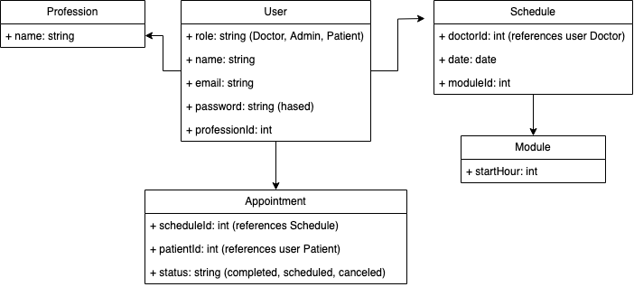

<div align="center"><h1> 👨‍⚕️✨ Medagenda ✨📆 </h1></div>

Medagenda es una aplicación utilizada tanto para medicos como pacientes para poder publicar y agendar consultas médicas. Se cumplió con la mayoría de los requisitos funcionales, además de algunos bonus implementados.

# Plataforma 💻

**Medagenda** se compone de tres elementos: 

* La carpeta Backend la cual es una aplicación en Node.js usando express.
* La carpeta medagenda con un proyecto en Vue3.js usando tailwind.
* Una base de datos en postgres.

# Instalación ⚙️

### Opción 1: 🐳 Docker
La forma más fácil de ejecutar el proyecto es a través de Docker 🐳

Para esto, basta con ejecutar el siguiente comando:

```sh
docker-compose up --build
```

Lo cual levantará 3 contenedores:
1. Un contenedor para PostgreSQL llamado `db`. En ```http://localhost:5432/```
2. Un backend corriendo en ```http://localhost:3000/```. Se pueden acceder a los endpoints mediante la ruta ```/api```. Por ejemplo, si se desea ver la lista de usuarios, la ruta sería: ```http://localhost:3000/api/users```
3. El frontend corriendo en ```http://localhost:8000/``` Este es fundamental ya que aquí es donde se visualiza la aplicación propiamente tal.

### Opción 2: Ejecución manual ⚡️

1. Crear una base de datos con el usuario postgres localmente con el nombre "medagenda". Los nombres especificos pueden ser modificados en el archivo ```.env``` dentro de la carpeta Backend.

2. Levantar el Backend. Para eso, posicionarse en el directorio Backend/ en la terminal y ejecutar los siguientes comandos:
```sh
npm install
```
```sh
yarn sequelize db:migrate
yarn sequelize db:seed:all
```
Y para levantarlo:
```sh
npm run dev
```
Es importante mencionar que para el proyecto se utilizó Node 18, por lo que podría ser necesario ejecutar:
```sh
nvm use 18
```
Para utilizar la version correspondiente.

4. Levantar el Frontend en medagenda. Para eso nos ubicamos en la carpeta medagenda/ y ejecutamos
```sh
npm install
```
Y para levantarlo:
```sh
npm run dev
```
# Diseño 📖️

Con respecto al esquema de la base de datos, se utilizaron 5 modelos:

1. User: Corresponden a los usuarios de la plataforma, los cuales pueden tener distintos roles:
    - role: String ('Doctor', 'Admin', 'Patient')
    - name: String
    - email: String
    - password: String (hashed)
    - professionId: Int

2. Schedules: Son las Agendas de disponibilidad de los doctores. Los doctores pueden generar muchas disponibilidades dependiendo del día y del módulo (hora) que prefieran. Los usuarios pueden agendar realizando un **Appointment** al respectivo Schedule:
    - doctorId: int references User (Doctor)
    - date: Date
    - moduleId: int references Module

3. Appointments: Son las reservas o el mecanismo para agendar servicios por parte del cliente. El usuario es capaz de seleccionar un Schedule y realizar un appointment a este:

    - scheduleId: Int references Schedule
    - patientId: Int references User (Patient)
    - stauts: String (Scheduled, Canceled, Completed)

4. Professions: Son las especialidades que puede tener un usuario Doctor. Un doctor solo puede tener una especialidad.

    - name: String 

4. Modules: Son los módulos horarios existentes. Por ahora se asume que solo tienen una hora de inicio y siempre duran una hora. Sin embargo, la idea de hacer los módulos es que sea modificable a futuro si se quieren incorporar nuevas funciones respecto a los horarios.

    - startHour: Int

A continuación se muestra un disño del Schema:

<div align="center"></div>

<hr>


<div align = "center"> Medagenda. All rights reserved.</div>
